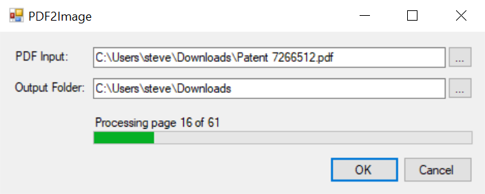

# PDF2Image
This is a very simple .NET Framework application, using existing Windows libraries, that
reads a given PDF file and exports each page as an individual JPG image.



Given a PDF file `C:\Docs\foo.pdf` with three pages

Then the following files are generated:
* `C:\Docs\foo-0.jpg`
* `C:\Docs\foo-1.jpg`
* `C:\Docs\foo-2.jpg`

## The Magic
There are about a bajillion PDF-to-Image libraries out there, some charging as much as $1,100 USD
for a single developer license! But here, I demonstrate in just 8 lines of code how to use existing
Windows UWP libraries to read the PDF, convert pages to images, and save them to an directory:

```csharp
var file = await StorageFile.GetFileFromPathAsync(inBox.Text);
var doc = await Windows.Data.Pdf.PdfDocument.LoadFromFileAsync(file);

for (int i = 0; i < doc.PageCount; i++)
{
	var page = doc.GetPage((uint)i);
	using (var stream = new InMemoryRandomAccessStream())
	{
		await page.RenderToStreamAsync(stream);
		using (var image = new Bitmap(stream.AsStream()))
		{
			image.Save($"{basename}-{i}", ImageFormat.Jpeg);
		}
	}
}
```

There are two files that need to be referenced in the project

* C:\Windows\Microsoft.NET\Framework64\v4.0.30319\System.Runtime.WindowsRuntime.dll
* C:\Program Files (x86)\Windows Kits\10\UnionMetadata\10.0.19041.0\Windows.winmd

Then add the following using statements to your class

```csharp
using Windows.Data.Pdf;
using Windows.Storage;
using Windows.Storage.Streams;
```

I just saved you $1,100. You're welcome.
 